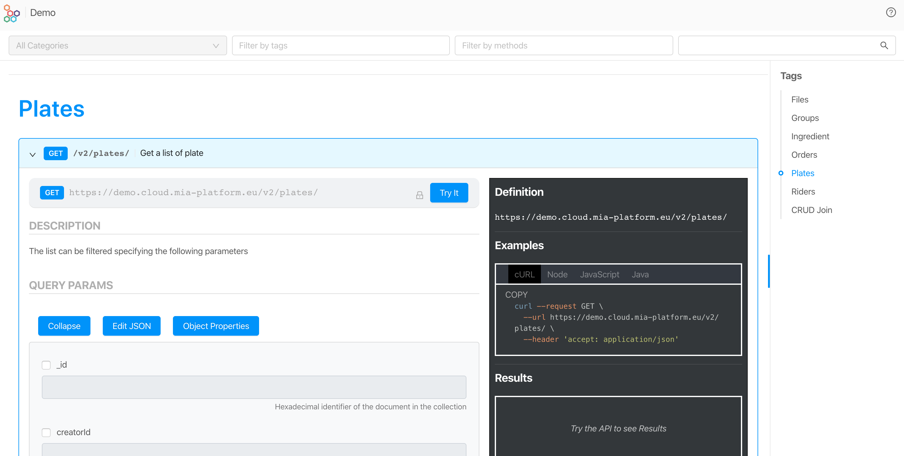
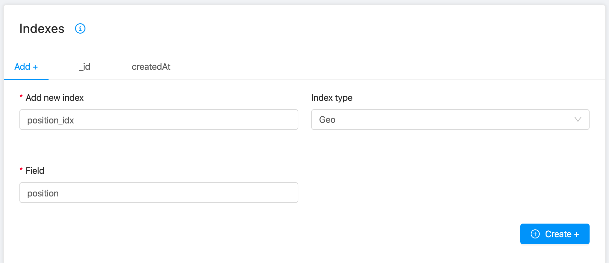

# CRUD Service

CRUD acronym stays for ***Create-Read-Update-Delete***. The CRUD Service purpose is to abstract a Data Collections allowing developers to expose CRUD APIs over the database in an easy, scalable, and secure way.

Mia-Platform Console takes advantage of the CRUD Service to let you configure CRUDs through a dedicated UI, the [MongoDB CRUD](../../development_suite/api-console/api-design/crud_advanced.md) section.

:::note
At the moment, you can have only one CRUD Service in your branch at a time.
:::

It's possible to configure CRUD Service with more than one collection and to scale it horizontally. In this section you will learn how to configure, deploy, and use Mia-Platform CRUD Service.

CRUD Service is available also as an Open Source Software (OSS), you can find the official repository [here](https://github.com/mia-platform/crud-service).

## Introduction

The CRUD Service is a microservice that exposes via Restful API a set of MongoDB Collection. CRUD Service is configured in the Console.

Via APIs it's possible to:

- read a collection and filter results;
- find elements of a collection using MongoDB query syntax;
- count number of elements in a collection;
- create a new element in a collection (also with a bulk action);
- update one or more elements of a collection;
- delete one or more elements of a collection.

The following guide will help you to get familiar with the APIs of the CRUD Service.



:::info
Remember: the API Portal visualize all API configured and exposed by CRUD.
:::

### Conventions

We will use the following naming conventions:

- **collection**: a set of JSON documents
- **document**: an item that belong to a collection
- **property**: a field of a document
- **value**: the value of a property
- **query string**: the filter set in the url query
- **body**: the JSON data passed in a request

In the following guide we will use a collection named *Plates* that contains a list of dishes with the following properties:

- name: name of the plate
- description: description of the plates
- price: price of the plate (in euro)
- ingredients: array of string with the id of the ingredients used
- image: array of photos (a JSON object)
- position: the geocoded position of a plate

## CRUD Collection Properties

Some collection field properties are predefined, others are custom and can be configured with different data types.

All properties can be indexed to speed up the data retrieval. The indexes configuration can be set in Console/Design/CRUD section.

### Predefined Collection Properties

CRUD by default comes with a set of common properties that simplify the data management:

| Property          | Type   | Description                                                                                                                                                                                                                                                                            |
|-------------------|--------|----------------------------------------------------------------------------------------------------------------------------------------------------------------------------------------------------------------------------------------------------------------------------------------|
| **`_id`**         | String | Unique 24 character length hexadecimal String that identifies a document in the collection.                                                                                                                                                                                            |
| **`creatorId`**   | String | Id of the user who created the document.                                                                                                                                                                                                                                               |
| **`createdAt`**   | Date   | Date and time when the document has been created.                                                                                                                                                                                                                                      |
| **`updaterId`**   | String | Id of the user who last updated the document; this information is overwritten every time the document is updated.                                                                                                                                                                      |
| **`updatedAt`**   | Date   | Date and time when the document has been updated; this information is overwritten every time the document is updated.                                                                                                                                                                  |
| **`__STATE__`**   | String | The current state of the document: can be one of `PUBLIC`, `DRAFT`, `TRASH`, `DELETED`. The state of the document can't be set directly, but can be changed via the dedicated REST API call. Allowed transitions are [illustrated below](#state-transitions). |

:::note
The only two default fields that it is possible to encrypt are `updaterId` and `creatorId`.
:::

Furthermore, you can edit the default fields in a limited way, in particular:

| Property          | Description | Encryption settings | GDPR sensitivity | GDPR description |
|-----------------  |-------------|---------------------|------------------|------------------|
| **`_id`**         | OK          | -                   | OK               | OK               |
| **`creatorId`**   | OK          | OK                  | OK               | OK               |
| **`createdAt`**   | OK          | -                   | OK               | OK               |
| **`updaterId`**   | OK          | OK                  | OK               | OK               |
| **`updatedAt`**   | OK          | -                   | OK               | OK               |
| **`__STATE__`**   | OK          | -                   | OK               | OK               |

For the `_id` field you can also change the `type`, choosing between:

- `ObjectId` (default value): corresponds to [MongoDB ObjectId](https://docs.mongodb.com/manual/reference/method/ObjectId/) that is the unique key to identify a document.
- `String`: id of type string that follows UUID v4 format.

#### Example of a Collection with only predefined Properties

If you create a CRUD named `empty` without any configuration in the Console, you will create a schema with the predefined properties. When you POST on that CRUD you will obtain the following document.

```shell
curl --request GET \
  --url https://your-url/v2/empty/ \
  --header 'accept: application/json' \
  --header 'client-key: client-key'
```

```json
{
  "__STATE__" : "PUBLIC",
  "_id" : "5e8a125eb74dbf0011444ed3",
  "createdAt" : "2020-04-05T17:16:14.175Z",
  "creatorId" : "public",
  "updatedAt" : "2020-04-05T17:16:14.175Z",
  "updaterId" : "public"
}
```

#### ```__STATE__``` management

**```__STATE__```** is a special field that allows the Mia-Platform CRUD Service to manage a simple publishing workflow. The ```__STATE__``` field can assume the following values:

##### STATE values

- **PUBLIC**: the document is visible without specifying the value of ```_st``` in the query string.
- **DRAFT**: the document is in draft status, to retrieve the document you need to specify in the query string the parameter ```_st=DRAFT```
- **TRASH**: the document is *soft deleted*; you can still query this document specifying in the query string  ```_st=TRASH```. The Mia-Platform Headless CMS will visualize this element in the Trash section and it's possible to recover it.
- **DELETED**: the document is *deleted*; you can still query this document specifying in the query string  ```_st=DELETED```. The Mia-Platform Headless CMS does not visualize this element, and it is possible to recover it only programmatically.

:::note
The query string can specify more than one status separating in with commas. Example: `_st=PUBLIC,DRAFT` return both PUBLIC and DRAFT documents.
:::

By default, when a new item in CRUD is added via POST, the document status is DRAFT. It's possible to change this behavior in the endpoint section of the CRUD changing the default behavior to PUBLIC. This configuration is available in Console/Design/Endpoints section.

It is also possible to enable *hard delete* function to delete permanently a document from the CMS.

##### State Transitions

Only the following transitions are allowed in the publish workflow.

| Source/Destination | PUBLIC  |  DRAFT | TRASH  | DELETED  |
|--------------------|---------|--------|--------|----------|
| PUBLIC             |    -    |   OK   |   OK   |   -      |
| DRAFT              |   OK    |   -    |   OK   |   -      |
| TRASH              |    -    |   OK   |   -    |   OK     |
| DELETED            |    -    |   -    |   OK   |   -      |

To transit the STATE of an item of a CRUD you need to POST it via the following endpoint:

```
POST /[COLLECTION_NAME]/{_id}/state
```

:::note
It is not possible to change the STATE of an item via a PATCH endpoint.
:::

For example, the following request will update from DRAFT (default state) to PUBLIC the collection document with `_id=5e8a125eb74dbf0011444ed3`:

```shell
curl --request POST \
  --url https://your-url/v2/empty/5e8a125eb74dbf0011444ed3/state \
  --header 'content-type: application/json' \
  --header 'client-key: client-key' \
  --data '{"stateTo":"PUBLIC"}'
```

### Collection Properties Types

When a new property is added to a collection, it is possible to specify the following types:

- String: UTF-8 character set
- Number
- Boolean
- GeoPoint (array of coordinates longitude, latitude)

```json
{
  "position": [
    9.232457,
    45.443919
  ]
}
```

- Date
- Object
- Array of Strings
- Array of Numbers
- Array of Objects

For the Objects and array of Objects, you could add a JSON Schema describing the expected properties.

### Collection document properties

Each property can be defined as:

- **required**: the property cannot be empty;
- **encrypted**: the property is encrypted at rest;
- **nullable**: the property can be null.

### Indexes

Any CRUD field can be indexed. In Console/Design/MongoDB CRUD, the following indexes can be configured:

- **Normal**: standard [MongoDB index](https://docs.mongodb.com/manual/indexes/) which can hold references to a single field or to multiple ones.
- **Geo**: geospatial index that supports queries on a 2D plane. Follow this [link](https://docs.mongodb.com/manual/geospatial-queries/) to learn more about MongoDB geospatial queries.
- **Hash**: hashed indexes use hashes of the value of a single field in order to distribute data across multiple machines, avoiding to overload a single machine. Visit MongoDB [documentation](https://docs.mongodb.com/manual/core/index-hashed/) to learn more about this type of indexes.
- **TTL**: single field indexes whose purpose is to automatically remove documents from a collection after a specific amount of time. MongoDB TTL indexes are explained in detail [here](https://docs.mongodb.com/manual/core/index-ttl/).

For the indexes of type Normal, Geo and TTL, you can choose whether to make the index unique. A unique index ensures that all the indexed fields do not possess duplicated values. If set, the value of the indexed fields must be unique in the collection.  

For the nested objects, it is possible to add an index using the dot notation to specify the indexed field.

:::warning
Every index that is not specified in the collection definition will be **dropped** at startup, unless its name starts with `preserve_` prefix
:::

## CRUD Headers

The CRUD service accepts the following header:

- ***acl_rows***: an array of MongoDB queries that limits the documents that a request can return. The value of acl_rows is a stringified JSON, which is in AND with the query string. Example:

```js
acl_rows: JSON.stringify([{ price: { $gt: MATCHING_PRICE } }])
```

- ***acl_read_columns***: the list of properties to return in the result (projection). It is an array of strings. Example:

```js
acl_read_columns: JSON.stringify(['name', 'author', 'isbn'])
```

- ***json-query-params-encoding***: the encoding in which the json query params are sent. This feature is only made to support HTTP clients like [OCI](https://docs.oracle.com/middleware/12211/odi/concepts/intro.htm) which have problems with special characters in the query params of the request, if you don't have such problems you most likely don't need to declare this header. Right now the only option is `base64` and any other value will be treated as if the params are URL encoded. Example:

```shell
curl --request GET \
  --url 'https://your-url/v2/plates/?_q=base64encodedjson' \
  --header 'json-query-params-encoding: base64'
```

- ***userId***: the identifier of the user that is doing the update.

Usually this is used by PRE/POST Orchestrator to manage concatenated request to CRUD.

## CRUD Security

### Expose a CRUD Service

:::warning
CRUD must **not** be exposed directly to the Internet. It must **always** be protected by the API Gateway or a BFF. In [Mia-Platform Console](/development_suite/overview-dev-suite.md) these security measures are already in place and the service is protected. If you use the [CRUD Service OSS](https://github.com/mia-platform/crud-service) we suggest that you protect it with an API Gateway even when it is used as a standalone component in your system and not to expose it directly to your front-end applications.
:::

### API Key

If a CRUD is exposed under an [API Key](../../development_suite/api-console/api-design/api-key) you have to pass the key into the request header with the name `client-key`.

Example:

```shell
curl --request GET \
  --url 'https://your-url/v2/your-crud-name/' \
  --header 'accept: */*' \
  --header 'client-key: your-client-key'
```

## CRUD Endpoints

APIs configured with Mia-Platform can be consumed with any technology that supports HTTP protocol. For tests during development we recommend one of the following tools:

- [curl](https://curl.haxx.se/)
- [insomnia](https://insomnia.rest/)
- [postman](https://www.getpostman.com/)

In the examples, we will use curl for brevity. Following are the typical operations that can be done with an API Restful CRUD created with Mia-Platform.

:::note
All of these examples can be tested using the API Portal of Mia-Platform. The Portal can be accessed using Console.
:::

Let's see how to perform C-R-U-D operations.

All examples are sent to <https://your-url> Mia-Platform instance. We assume that the endpoints are only protected by API Key.

```
client-key: client-key
```

If your endpoints are also protected by authentication and authorization, you need to pass the access token to the curl command.

### Create

It's possible to create one or more documents in a collection. If the MongoDB collection doesn't exist, the CRUD Service creates it automatically and force the indexes configured in Console. A document can be created in three different ways:

- inserting a single JSON document;
- inserting or updating one JSON document;
- inserting multiple JSON documents (bulk).

The JSON document sent to CRUD is validated against the JSON schema defined in Console before the insertion.

#### Insert a single document

To create a document, use *POST* request. As the body of the request, provide the JSON representation of the new document.

For example, if you want to store a new document in the exposed collection `plates`, you need to create a JSON like this one:

```json
{
  "name": "Spaghetti with tomato sauce",
  "description": "The classic italian dish"
}
```

Then you have to insert it in the collection using a POST request, like the following one:

```shell
curl --request POST \
  --url https://your-url/v2/plates/ \
  --header 'accept: application/json' \
  --header 'content-type: application/json' \
  --header 'client-key: client-key' \
  --data '{"name":"Spaghetti with tomato sauce","description":"The classic italian dish"}'
```

In response, you will get a JSON object like the one below, where **_id** is the unique identifier of the new document inserted:

```json
{
  "_id":"5e8ae13bb74dbf0011444ed5"
}
```

#### Insert or Update one document

If you are not sure if the document is already present in the collection, you can use the Insert or Update feature calling the `upsert-one` endpoint. You need to specify in query parameters all data to match eventually the existent document and in request body the JSON document you want to insert or update.

```shell
curl --request POST \
  --url 'https://your-url/v2/plates/upsert-one?name=Spaghetti%20allo%20Scoglio' \
  --header 'accept: application/json' \
  --header 'content-type: application/json' \
  --header 'client-key: client-key' \
  --data '{"$set":{"name":"Spaghetti with seafood"}}'
```

In response, you will obtain the document if it already exists, or a new document if it is not present. The document will reflect all the updates you specified.

:::note
If you don't specify the query string the first document of the collection is updated.
:::

If instead of ```$set``` you use ```$setOnInsert```, values are set only if the document don't exist.

With `upsert-one`, you can also manipulate a single document in the same instance when you insert or update it. This is really useful when you want to update the document and set a value at the same time. More details below.

:::note
Two steps take place when the `upsert-one` operation is executed: firstly, it searches for the document, and secondly it updates the document or insert a new one. Be aware that this operation is not atomic.
:::

##### Unset an item value

If you want to unset an item value when you update it, just use `$unset`. For example, you want to insert a new document with Rice and unset the price.

```json
[
  {
    "_id": "5e9482ed0fb46200115f9231",
    "name": "Rice",
    "description":  "The description",
    "price": "20",
    "__STATE__": "PUBLIC",
    "creatorId": "public",
    "updaterId": "public",
    "updatedAt": "2020-04-13T15:19:09.465Z",
    "createdAt": "2020-04-13T15:19:09.465Z"
  }
]
```

Just perform the call:

```shell
curl --request POST \
  --url 'https://your-url/v2/plates/upsert-one?name=Rice' \
  --header 'accept: application/json' \
  --header 'content-type: application/json' \
  --header 'client-key: client-key' \
  --data '{"$set":{"description":"The correct description"},"$unset":{"price":true}}'
```

The document will become the following, without the price property and with the updated description.

```json
[
  {
    "_id": "5e9482ed0fb46200115f9231",
    "name": "Rice",
    "description": "The correct description",
    "__STATE__": "PUBLIC",
    "creatorId": "public",
    "updaterId": "public",
    "updatedAt": "2020-04-13T15:26:51.611Z",
    "createdAt": "2020-04-13T15:19:09.465Z"
  }
]
```

#### Insert multiple documents

The bulk insert can be performed POST on CRUD a JSON **array** of documents. For example, to add three dishes to plates collection you have to POST the `/bulk` on the resource.

```shell
curl --request POST \
  --url https://your-url/v2/plates/bulk \
  --header 'accept: application/json' \
  --header 'content-type: application/json' \
  --header 'client-key: client-key' \
  --data '[{"name":"Risotto with champinones mushrooms","description":"Risotto with champinones mushrooms"},{"name":"Lasagna","description":"Stacked layers of flat pasta alternating with fillings such as Bolognese sauce"},{"name":"Tiramisu","description":"Biscuits dipped in coffee, layered with a whipped mixture of eggs, sugar, and mascarpone cheese"}]'
```

```json
[
  {
    "_id": "5e8af37ab74dbf0011444ed6"
  },
  {
    "_id": "5e8af37ab74dbf0011444ed7"
  },
  {
    "_id": "5e8af37ab74dbf0011444ed8"
  }
]
```

### Read

In this section you will learn how to query a collection.

#### Get a list of documents

To list a collection, simply call the endpoint with a **GET**.

```shell
curl -X GET https://your-url/v2/plates/ \
-H  "accept: application/json"  \
-H  "content-type: application/json" \
-H  "client-key: client-key"
```

:::warning
Always end you request with a slash.  <https://your-url/plates/> is correct.  <https://your-url/plates> is wrong.
:::

In response of this request, you will get a JSON array that contains all the documents of the collection. The sorting is by insertion. The request return only documents with ```__STATE__``` equal to PUBLIC. To retrieve other documents you must set `STATE` to DRAFT.

```json
[
  {
    "__STATE__": "PUBLIC",
    "_id": "5df78b5287393f00114e0f20",
    "createdAt": "2019-12-16T13:49:06.759Z",
    "creatorId": "5c4fd1d2-c6d8-4c65-8885-0b74f0309d0f",
    "description": "The correct description",
    "image": [],
    "ingredient": [
      "5e8200fa2e9dde00112b6853",
      "5e81feaf2e9dde00112b684f",
      "5e81fd882e9dde00112b6849",
      "5e8202892e9dde00112b685c"
    ],
    "name": "Smoked salmon",
    "updatedAt": "2020-04-13T15:26:19.819Z",
    "updaterId": "public"
  },
  {
    "__STATE__": "PUBLIC",
    "_id": "5df8aff66498d30011b19e4d",
    "createdAt": "2019-12-17T10:37:42.551Z",
    "creatorId": "5c4fd1d2-c6d8-4c65-8885-0b74f0309d0f",
    "description": "",
    "image": [],
    "ingredient": [
      "5e81fddd2e9dde00112b684c"
    ],
    "name": "FRIED VEGGIE NOODLE",
    "price": "10",
    "updatedAt": "2020-03-30T14:29:31.791Z",
    "updaterId": "auth0|5e81fb3565a28c0c5dbaa8c7"
  }
]
```

:::note
The maximum number of documents returned are configurable through the variable *CRUD_MAX_LIMIT*. If you want more documents please use pagination. You can change this behavior setting the variable *CRUD_LIMIT_CONSTRAINT_ENABLED* to false. If you change it be aware that you can hang the service for out of memory error.
:::

#### Get a single document by _id

To read just one document, simply pass the *_id* of the document as path parameter.

```shell
curl -X GET https://your-url/v2/plates/5df8aff66498d30011b19e4d \
-H  "accept: application/json"  \
-H  "content-type: application/json" \
-H  "client-key: client-key"
```

In response to this request, you get a JSON Object like the following.

```json
{
  "__STATE__": "PUBLIC",
  "_id": "5df8aff66498d30011b19e4d",
  "createdAt": "2019-12-17T10:37:42.551Z",
  "creatorId": "5c4fd1d2-c6d8-4c65-8885-0b74f0309d0f",
  "description": "",
  "image": [
    {
      "_id": "5df8bb3295a2a500117fc8d2",
      "file": "5df8bb328fa0c0000fb334e3.jpg",
      "location": "https://your-url/files/download/5df8bb328fa0c0000fb334e3.jpg",
      "name": "close-up-photo-of-cooked-pasta-2456435.jpg",
      "size": 94274,
      "type": "image/jpeg"
    }
  ],
  "ingredient": [
    "5e81fddd2e9dde00112b684c",
    "5e81feaf2e9dde00112b684f",
    "5e81fd882e9dde00112b6849"
  ],
  "name": "FRIED VEGGIE NOODLE",
  "price": "10",
  "updatedAt": "2020-03-30T14:29:31.791Z",
  "updaterId": "auth0|5e81fb3565a28c0c5dbaa8c7"
}
```

:::note
The query will return only PUBLIC documents. To retrieve a DRAFT document add to query string ```&_st=DRAFT```.
:::

#### Sort

It is possible to sort the list of documents returned by a GET passing to the query string the **_s** parameter. The value of the parameter is the following:

```shell
[-|empty]<property name>
```

By default, the sorting is ascending; use `-` for descending. The following call sorts plates by names in alphabetical order.

```shell
curl --request GET \
  --url 'https://your-url/v2/plates/?_s=name' \
  --header 'accept: application/json' \
  --header 'client-key: client-key'
```

Sorting for multiple values is made possible by passing multiple times the **_s** query parameter with the desired property, or by passing a comma separated list of values to the **_s**, as done in the examples below.

```shell
curl --request GET \
  --url 'https://your-url/v2/plates/?_s=name&_s=surname' \
  --header 'accept: application/json' \
  --header 'client-key: client-key'
```

It's possible to sort nested values, too.

```shell
curl --request GET \
  --url 'https://your-url/v2/plates/?_s=name,registry.surname' \
  --header 'accept: application/json' \
  --header 'client-key: client-key'
```


#### Paginate

By default, GET returns a limited number of documents. You can use pagination to return more documents. Pagination accepts filters and sorts parameters.

To paginate, use the following query parameters:

- **_l**: limits the number of documents returned. Minimum value 1. Maximum value can be configured with the environment variable *CRUD_MAX_LIMIT*. 
:::warning
If you pass such limit, the CRUD Service truncate to *CRUD_MAX_LIMIT* the result unless the environment variable named *CRUD_LIMIT_CONSTRAINT_ENABLED* is set to *false*.
:::
- **_sk**: skip the specified number of documents. Minimum value 0. Maximum value is `bigint`.

This is an example of a request that gets *two documents per page*, and you want to ask for the *third page* (skip 4 documents).

```shell
curl --request GET \
  --url 'https://your-url/v2/plates/?_l=2&_sk=4' \
  --header 'accept: application/json' \
  --header 'client-key: client-key'
```

Combining `_l` and `_sk`, you can paginate the request. If you want to visualize the number of pages in your UI, you need also count with a request the number of documents.

#### Return a subset of properties

You can return just some document properties (like GraphQL sub-selection or SQL select) using `_p` parameter. You can select multiple properties separated by commas.

```shell
curl --request GET \
  --url 'https://your-url/v2/plates/?_p=name,price' \
  --header 'accept: application/json' \
  --header 'client-key: client-key'
```

Returns an array of documents with only the properties requested.

```json
[
  {
    "_id": "5df8aff66498d30011b19e4d",
    "name": "FRIED VEGGIE NOODLE",
    "price": "10"
  },
  {
    "_id": "5df8b8546498d30011b19e4e",
    "name": "SPINACH CHICKEN SALAD",
    "price": "12"
  }
]
```

As an alternative to `_p`, in v4.3.0 a new query parameter `_rawp` has been added to let the user express the projection of the fields as a raw MongoDB projection in JSON.

This allows an improved expressibility and let the user get advantage of some MongoDB features not included in the `_p`, such as excluding fields by setting them to `0` in the projection, or using the MongoDB aggregation operators.

Here follow some examples of its usage:

```shell title="Simple projection of some fields"
curl --request GET \
  --url 'https://your-url/v2/plates/?_rawp={"someField":1,"someOtherField":1}' \
  --header 'accept: application/json' \
  --header 'client-key: client-key'
```

```shell title="Exclude some fields"
curl --request GET \
  --url 'https://your-url/v2/plates/?_rawp={"excludedField":0,"someOtherExcludedField":0}' \
  --header 'accept: application/json' \
  --header 'client-key: client-key'
```

```shell title="Use a $filter operator to get only the objects with someSubfield=someValue of an array someArray"
curl --request GET \
  --url 'https://your-url/v2/plates/?_rawp={"result":{"$filter":{"input":"$someArray","as":"item","cond":{"$$item.someSubfield":"someValue"}}}}' \
  --header 'accept: application/json' \
  --header 'client-key: client-key'
```

The list of currently supported MongoDB aggregation operators is the following:

- Comparison: `$eq`, `$gt`, `$gte`, `$in`, `$lt`, `$lte`, `$ne`, `$nin`;
- Logical: `$and`, `$not`, `$nor`, `$or`;
- Evaluation: `$exists`, `$type`, `$cond`, `$regexMatch`, `$mod`;
- Array: `$filter`, `$reduce`, `$concatArrays`, `$first`, `$map`, `$all`, `$elemMatch`, `$size`;
- Conversion: `$dateToString`.

:::caution
`_p` and `_rawp` cannot be used at the same time. The use of aggregation operators inside a projection is supported only on MongoDB v4.4+.
:::

Here you can find the official Mongo documentation about the [projection](https://www.mongodb.com/docs/manual/reference/method/db.collection.find/#std-label-method-find-projection) field into the find operator.

:::note
If you have problems with the special characters in the URL encoding, you can try the `json-query-params-encoding` header. More info at ([CRUD Headers](./overview_and_usage.md#crud-headers))
:::

#### Combine all together

You can combine all together. For example to get the first 2 plates, sorted by name with just name and ingredients, do the following request.

```shell
curl --request GET \
  --url 'https://your-url/v2/plates/?_s=name&_l=2&_sk=0&_p=name,ingredient' \
  --header 'accept: application/json' \
  --header 'client-key: client-key'
```

#### Filters with MongoDB Query

Documents can be filtered using MongoDB queries. It is possible to filter in and or in cascade quoting all of them the properties of documents. [More details on the MongoDB site for queries on a resource](Https://docs.mongodb.com/manual/tutorial/query-documents/)

For example, we can look for plates that have a name that begins with V, that have price and two ingredients.

```json
{
  "$and": [
    {
      "price": {
        "$exists": true
      }
    },
    {
      "ingredient": {
        "$size": 2
      }
    },
    {
      "name": {
        "$regex": "^V",
        "$options": "i"
      }
    }
  ]
}
```

The query must be URL encoded and passed to `_q` parameter:

```shell
curl --request GET \
  --url 'https://your-url/v2/plates/?_q=%7B%22%24and%22%3A%5B%20%20%20%20%20%7B%22ingredient%22%3A%7B%22%24size%22%3A%202%7D%7D%2C%20%7B%22price%22%3A%7B%22%24exists%22%3Atrue%7D%7D%2C%7B%22name%22%3A%7B%22%24regex%22%3A%22%5EV%22%2C%22%24options%22%3A%22i%22%7D%7D%20%5D%20%7D' \
  --header 'accept: application/json' \
  --header 'client-key: client-key'
```

You can use more MongoDB filters in query **_q**. Here is the complete list:

- `$gt`
- `$lt`
- `$gte`
- `$lte`
- `$eq`
- `$ne`
- `$in`
- `$nin`
- `$all`
- `$exists`
- `$nearSphere`
- `$regex`
- `$elemMatch` and `$options`
- `$text`

Aggregate cannot be used. To use aggregate please see [Mia-Platform MongoDB Reader Service](../mongodb-reader/configuration.md).

:::note
If you have problems with the special characters in the URL encoding, you can try the `json-query-params-encoding` header. More info at ([CRUD Headers](./overview_and_usage.md#crud-headers)).
:::

#### Count

It may be helpful to know how many documents contains a list of documents. For this purpose it is sufficient to invoke a GET on the `/count` of the resource:

```shell
curl -X GET https://your-url/v2/plates/count -H  "accept: application/json" -H  "content-type: application/json" -H  "client-key: client-key"
```

This will return:

```json
3
```

:::note
Filters can be applied to the count. By default, only PUBLIC documents are counted.
:::

#### Geospatial Queries

On CRUD service, it is possible to filter data also for proximity, using MongoDB Geospatial Queries.

To enable this feature, you need to create a Position index on Console.



When the index is created, you can use the `$nearSphere` parameter. For example, to search a plate near you, between 0 meters and 1200 meters from your position longitude: 9.18 and latitude: 45.46 (Milan, Italy), you can use this MongoDB query.

```json
{
  "position": {
    "$nearSphere": {
      "from": [
        9.18,
        45.43
      ],
      "minDistance": 0,
      "maxDistance": 1200
    }
  }
}
```

:::caution
This query is not supported on count API due to MongoDB restrictions.
:::

To get the list of plates, just encode the query and use `_q`.

```shell
curl --request GET \
  --url 'https://your-url/v2/plates/?_q=%20%7B%22position%22%3A%7B%22%24nearSphere%22%3A%7B%22from%22%3A%5B9.18%2C45.43%5D%2C%22minDistance%22%3A0%2C%22maxDistance%22%3A1200%7D%7D%7D' \
  --header 'accept: application/json' \
  --header 'client-key: client-key'
```

The results will be sorted from the nearest to the furthest.

#### Text Search Queries

On CRUD service it is possible to filter text fields which match a search filter, using MongoDB Text Search Queries.
The query string is parsed and single words are used to query the Text index. A match is evaluated when the text value of an indexed field is considered to be the same word, according to language rules. Indeed, it might be essential to set the `$language` option (English is the default language).
See [$text](https://docs.mongodb.com/manual/reference/operator/query/text/) documentation to go in detail.

:::caution
Text search can't be used when encryption is enabled. For further information check out the official [MongoDB documentation](https://www.mongodb.com/docs/manual/reference/security-client-side-query-aggregation-support/#supported-query-operators).
:::

To enable this feature, you need to create a Text index on Console. No more than one Text index can exist, but it can cover multiple fields. Only strings and arrays of strings can be indexed by a Text index.

For example, to search a plate with a `name` matching the word "FRIED" (by default the `$caseSensitive` is set to `false`), after creating a Text index on the field `name`, you can use this `$text` MongoDB query.

```json
{
  "$text": {
    "$search": "FRIED",
    "$caseSensitive": true
  }
}
```

To get the list of plates, just encode the query and use `_q`.

```shell
curl --request GET \
  --url 'https://your-url/v2/plates/?_q=%7B%20%22%24text%22%3A%7B%20%22%24search%22%3A%20%22FRIED%22%2C%20%22%24caseSensitive%22%3A%20true%20%7D%7D' \
  --header 'accept: application/json' \
  --header 'client-key: client-key'
```

The results will be sorted by text relevance score, contrary to MongoDB `$text` query which returns no order by default.

### Update

You can update one or more documents in a collection. The operations of the update are made by using a **PATCH** request:

In the body of the request you can use the following operators:

- `$set`
  This operator replaces the value of the field with specified value:  
  `{ $set: { <field1>: <value1>, ... } }`

- `$unset`
  This operator unset a particular item value:  
  `{ $unset: { <field1>: true, ... } }`

- `$inc`
  This operator increments a field by a specified value:  
  `{ $inc: {<field1>: <amount1>, <field2>: <amount2>, ...} }`

- `$mul`
  This operator multiply the value of a field by a specified number:  
  `{ $mul: { <field1>: <number1>, ... } }`

- `$currentDate`
  This operator sets the value of a field to the current date:  
  `{ $currentDate: { <field1>: true, ... } }`
:::note
The field must be of type `Date`. The format of dates it's **ISO-8601**: YYYY-MM-DDTHH:mm:ss.sssZ.
:::

- `$push`
  This operator appends a specified value to an array field:  
  `{ $push: { <field1>: {<prop1>: <value1>, <prop2>: <value2>, ...}, ... } }`

- `$pull`
  This operator removes a specified value from an array field:  
  `{ $pull: { <field1>: <value1>, ...} }`

- `$addToSet`
  This operator appends a specified value to an array field unless the value is already present:  
  `{ $addToSet: { <field1>: <value1>, ...} }`

:::tip
The syntax is [MongoDB Field Update Operators](https://docs.mongodb.com/manual/reference/operator/update-field/) like.
:::

#### Update a single document

To update a single document, use `PATCH` passing the *_id* of the document as path parameter.  
In the body, you have to pass a JSON with the desired operators set.

The route to call is the following:

`PATCH` `https://your-url/<CRUD collection endpoint>/{id}`

Below you can see an example:

```shell
curl --location --request PATCH 'your-url.mia-platform.eu/v2/books/1f11d444830aaz0011526361' \
--header 'Content-Type: application/json' \
--data-raw '{
    "$set": {
        "title": "The Caves of Steel",
        "author: "Isaac Asimov"
    },
    "$inc": {
      "qta":1
    }
}'
```

:::caution
If you want to update an [Array RawObject property](#rawobject-and-array_rawobject-with-schemas) using the [positional operators](https://docs.mongodb.com/manual/reference/operator/update/positional-all/) `.$.merge` and `.$.replace`, you have to specify the position of the element by filtering by property with the [`_q` query param](#filters-with-mongodb-query).  
You have to filter the field by object/value. The value of the filter must be URL encoded. If the **filter matches multiple elements, only the first occurrence will be patched**.

The following example replaces the element of the property `arrayOfAuthors` containing the value `{"name:"wrongName"}` with the object `{"name":"author correct name"}`. The not encoded `_q` is `arrayOfAuthors={"name":"wrongName"}`:

```shell
curl --location --request PATCH 'your-url.mia-platform.eu/v2/books/1f11d444830aaz0011526361?_q=%7B%arrayOfAuthors%22%3A%7B%22name%22%3A%2222wrongName%22%7D%7D' \
--header 'Content-Type: application/json' \
--data-raw '{
    "$set": {
        "arrayOfAuthors.$.replace":{"name":"author correct name"},
    },
}'
```

This is valid for **all types of Array field**, including arrays of numbers and strings.
:::

#### Update multiple documents

To update multiple documents, you have two possibilities:

- **Update multiple documents that match a query**  
  For this action, you have to use a **PATCH** request, filtering by query parameters the documents you want to update.  
  You can filter by fields values, the [_q query param](#filters-with-mongodb-query) and [STATE](#predefined-collection-properties) using `_st` param.  
  In the body you have to pass a JSON with the desired set of operators with the new values.

  The route to call is the following:

  `PATCH` `https://your-url/<CRUD collection endpoint>/`

  Below you can see an example:

  ```shell
  curl --location --request PATCH 'url.mia-platform.eu/v2/books/?category=sci-fi&_st=PUBLIC' \
  --header 'Content-Type: application/json' \
  --data-raw '{
      "$set": {
        "discount": true
      }
  }'
  ```

- **Update multiple documents, each one with its own modifications**  
  For this action, you have to use a **PATCH** request with an array as the request body.
  Each element represents a document to update, and it's an object with the following properties:
  - `filter`:
    Contains the filter conditions for select the document. As seen above you can filter by fields values, the [_q query param](#filters-with-mongodb-query), and `_st` parameter.
  - `update`:
    Contains the update operators with the new values.

  The route to call is the following:

  `PATCH` `https://your-url/<CRUD collection endpoint>/bulk`

  Below you can see an example:

  ```shell
  curl --location --request PATCH 'url.mia-platform.eu/v2/books/bulk' \
  --header 'Content-Type: application/json' \
  --data-raw '[
    {
      "filter":{"_id":"1f11d444830aaz0011526361"},
      "update": {
        "$set": {
          "discount": true
        }
      }
    },   
    {
      "filter":{_id":"2f11d514830aaz0071523223"},
      "update": {
        "$set": {
          "discount": true
        }
      }
    }

  ]'
  ```

### Delete

You can delete one or more documents in a collection.

#### Delete a single document

To delete a single document use a **DELETE** request, passing the *_id* of the document as path parameter.  

The route to call is the following:

`DELETE` `https://your-url/<CRUD collection endpoint>/{id}`

Below you can see an example:

```shell
curl --location --request DELETE 'url.mia-platform.eu/v2/books/1f11d444830aaz0011526361'
```

In case the document exists, the endpoint answers with a `204 No Content`, if doesn't, it responds with a `404 Not Found`.

#### Delete multiple documents

To delete multiple document you have to use a `DELETE` request, filtering by query parameters the documents you want to delete.  
You can filter by fields values, the [_q query param](#filters-with-mongodb-query), and [STATE](#predefined-collection-properties) using `_st` parameter.  

The route to call is the following:

`DELETE` `https://your-url/<CRUD collection endpoint>/`

Below you can see an example:

```shell
curl --location --request DELETE 'url.mia-platform.eu/v2/books/?category=sci-fi&_st=DRAFT'
```

The endpoint always responds `200 OK`, with an integer number in the body representing the count of deleted documents. 
The response is 200 also when no documents are found, in that case the count will be 0.

### RawObject and Array_RawObject with schemas

Nested properties of a field of type `RawObject` and `Array_RawObject` can be used in REST APIs with object notation or dot notation.

```shell title="Example of PATCH with dot notation"
curl --location --request PATCH 'your-url.mia-platform.eu/v2/books/111111111111111111111111' \
--header 'Content-Type: application/json' \
--data-raw '{
    "$set": {
        "metadata.somethingArrayObject.0.anotherNumber": "3",
        "metadata.somethingObject.childNumber": "9"
    }
}'
```

```shell title="Example of PATCH with object notation"
curl --location --request PATCH 'your-url.mia-platform.eu/v2/books/111111111111111111111111' \
--header 'Content-Type: application/json' \
--data-raw '{
    "$set": {
        "metadata": {
          "somethingArrayObject": [
            {"anotherNumber": "3"}
          ],
          "somethingObject": {
            "childNumber": "9"
          }
        }
    }
}'
```

The two operations above have different effect.  
*"metadata.somethingObject.childNumber": "9"* assigns "9" to the field "childNumber".  

In the "Example with object notation" you are setting a value to the field *metadata*.  
So the field *metadata* will be exactly:

```json
{
  "somethingArrayObject": [
    {
      "anotherNumber": "3"
    }
  ],
  "somethingObject": {
    "childNumber": "9"
  }
}
```

Values will be casted based on the JSON Schema.  
So, if *childNumber* is *{ "type": "number" }*, it will be casted from string *9* to number *9*.

:::note
In the `$unset` operation of nested properties there is no validation that the properties you are unsetting are required or not, and the unset of a required property will be an error getting the document. Be careful when you use `$unset` on nested properties.
:::

Fields of type `RawObject` without a schema can also be used in REST APIs (e.g. in a `$set` of a *`PATCH`*) with dot notation. The field have to be valid against the following pattern: *FIELD_NAME.* where *FIELD_NAME* is the name of the field. (e.g.: `*set: { "myObject.something": "foobar"}*`).

:::note
The pattern contains `.` and not `\.`, so it's "any character" and not "dot character". It's been kept in this way for retrocompatibility reasons.
:::

The operators **.$.merge** and **.$.replace** can also be used on nested arrays.

Example of **$.replace** with a **PATCH bulk**:

```shell
curl --location --request PATCH 'demo.mia-platform.eu/v2/books/bulk' \
--header 'Content-Type: application/json' \
--data-raw '{
    "filter": {
              "_id": "111111111111111111111111",
              "metadata.somethingArrayOfNumbers": 3
    },
    "$set": {
        "metadata.somethingArrayOfNumbers.$.replace": 5
    }
}'
```

This will update the item of the collection *books* with *_id* equals to 111111111111111111111111 and that have an item of the array *somethingArrayOfNumbers* inside *metadata* equals to 3.
It will be set to 5 the item of *somethingArrayOfNumbers* equals to 3.  

In case of array of objects, you can also use **$.merge** operators.

```shell
curl --location --request PATCH 'demo.mia-platform.eu/v2/books/bulk' \
--header 'Content-Type: application/json' \
--data-raw '{
    "filter": {
              "_id": "111111111111111111111111",
              "metadata.somethingArrayObject": {"anotherNumber": 3, "somethingElse": "foo"}
    },
    "$set": {
        "metadata.somethingArrayObject.$.merge": {"anotherNumber": 5}
    }
}'
```

This will update the item of the collection *books* with *_id* equals to 111111111111111111111111 and that have an item of the array *somethingArrayObject* inside *metadata* equals to *{"anotherNumber": 3, "somethingElse": "foo"}*.
It will be set to 5 the field *anotherNumber* of the item of *somethingArrayObject* that have matched the query of the filter (so that was equals to *{"anotherNumber": 3, "somethingElse": "foo"}*)

:::warning
The values of **$.replace** and **$.merge** does not support "dot notation". So you cannot do: *"something.$.merge": {"foo.bar.lorem": 5}*
:::

### CRUD Limits

CRUD service has the following limits:

- dimension of a single item in a collection: 16 MB.
- default number of returned items of a collection from a GET: 200.

### Response codes of CRUD

Below is a list of return codes typical of an API request:

#### 2xx (Success category)

| Code    | Message    | Description                                                                                                                                                        |
|---------|------------|--------------------------------------------------------------------------------------------------------------------------------------------------------------------|
| **200** | Ok         | The standard HTTP response representing success for GET, PUT or POST.                                                                                              |
| **201** | Created    | This status code should be returned whenever the new instance is created. E.g on creating a new instance, using POST method, should always return 201 status code. |
| **204** | No Content | The request is successfully processed, but has not returned any content.                                                                                           |

#### 3xx (Redirection Category)

| Code    | Message      | Description                                                                                                                  |
|---------|--------------|------------------------------------------------------------------------------------------------------------------------------|
| **304** | Not Modified | Indicates that the client has the response already in its cache, and hence there is no need to transfer the same data again. |

#### 4xx (Client Error Category)

These status codes represent that the client has raised a faulty request.

| Code    | Message      | Description                                                                                                                                                                                                                                 |
|---------|--------------|---------------------------------------------------------------------------------------------------------------------------------------------------------------------------------------------------------------------------------------------|
| **400** | Bad Request  | Indicates that the request by the client was not processed, as the server could not understand what the client is asking for.                                                                                                               |
| **401** | Unauthorized | Indicates that the client is not allowed to access documents, and should re-request with the required credentials.                                                                                                                          |
| **403** | Forbidden    | Indicates that the request is valid and the client is authenticated, but the client is not allowed to access the page or resource for any reason. E.g sometimes the authorized client is not allowed to access the directory on the server. |
| **404** | Not Found    | Indicates that the requested resource is not available now.                                                                                                                                                                                 |
| **410** | Gone         | Indicates that the requested resource is no longer available because ot has been intentionally moved.                                                                                                                                       |

#### 5xx (Server Error Category)

| Code    | Message               | Description                                                                                                                          |
|---------|-----------------------|--------------------------------------------------------------------------------------------------------------------------------------|
| **500** | Internal Server Error | Indicates that the request is valid, but the server is totally confused and the server is asked to serve some unexpected condition.  |
| **503** | Service Unavailable   | Indicates that the server is down or unavailable to receive and process the request. Mostly if the server is undergoing maintenance. |
